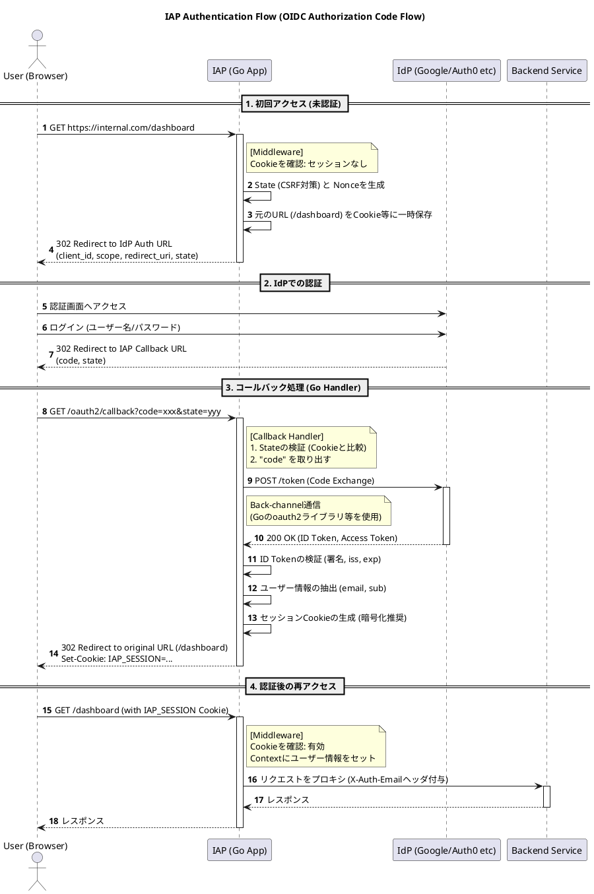
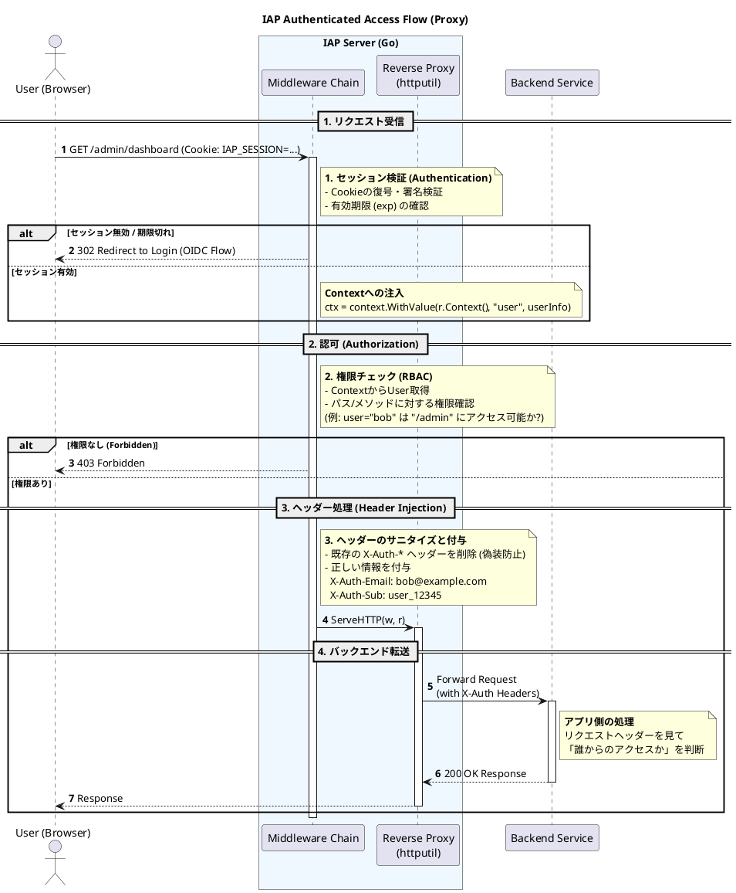

# Identity_Aware Proxyの仕組み

## IAPの主な機能

### コンテナ

- IAPとアプリケーションの通信を中継するサーバーでオンプレミスやIaaS側へ配置される
- この機能による社内リソースへの安全な通信、アクセスが可能になる

### エージェント

- エンドユーザーの端末にインストールされる
- ブラウザベースでは対応しきれないHTTPS以外のプロトコルでアクセスできるようになる

### IAM連携

- アプリケーション利用の認証、認可を認証基盤(IAM)によって行う仕組み
- 既設の認証基盤を利用することが可能となる

### デバイスポスチャ

- 接続端末のリスクを判断する機能
- 端末の状態を判断しアクセスを許可するかを判断する
- EDRと連携する機能を持つものもある

## リクエスト処理の流れ

### 未認証時のフロー(初回アクセス, セッション切れ)

ユーザーが初めてアクセスしてきた場合、IAPはIdP(Google Auth0, Oktaなど)を使って認証を行う

1. リクエスト受信, セッション確認
    - ユーザーが特定のURLへアクセスする
    - IAPはCookieを確認し、セッションID(またはJWT)が存在しない、あるいは無効であることを検知する
2. OIDC認証リクエストの構築(State生成)
    - IAPはCSRF対策のためのランダムな文字列(state)と、認証後の戻り先URL(nonceやリダイレクトURL)を生成し、
    Cookieやメモリ内のキャッシュに保存する
3. IdPへのリダイレクト
    - IAPはユーザーをIdPの認証画面へリダイレクトさせる
4. ユーザー認証, コールバック
    - ユーザーがIdPでログインを完了すると、IdPはIAPのコールバックURL（例: /oauth2/callback）へリダイレクトする
    - この際、code(認可コード)とstateが付与される
5. Token Exchange, 検証
    - IAPのコールバックハンドラが起動する
    - State検証
        - リクエストに含まれるstateが、2.で保存したものと一致するか確認する(CSRF対策)
    - トークン交換
        - code を使ってIdPのトークンエンドポイントを叩き、ID Token（とAccess Token）を取得する
6. セッション確率
    - 検証済みのユーザー情報（Email, Subなど）を元に、IAP独自のセッションCookieを発行し、ブラウザにセットする
    - ユーザーを本来のアクセス先へリダイレクトする

### 認証済みのフロー(通常アクセス)

すでにログイン済みのユーザーからのリクエスト処理

1. リクエスト受信(Middleware)
    - リクエストヘッダーのCookieからセッションの情報を読み取る
2. セッションの検証
    - セッションが改ざんされていないか、有効期限以内かを確認する
3. 認可(Authorization)チェック
4. ヘッダーインジェクション
    - バックエンドアプリが「誰がアクセスしているか」を把握するため、特定のリクエストヘッダーを付与する
    - 一般的に使われるヘッダー
      - X-Auth-Request-User: emailアドレス
      - X-Auth-Request-Email: emailアドレス
      - X-Auth-Request-Sub: ユーザーの一意なID
    - セキュリティ注意点
      - クライアントから偽装された同名のヘッダーが送られてくる可能性があるため、プロキシする前にこれらのヘッダーを一度削除(Sanitize)してから、IAPが付与しなおす必要がある
5. バックエンドへのプロキシ(Reverse Proxy)
    - リクエストをバックエンドサーバーへ転送する
    - バックエンドからのレスポンスを受け取り、そのままクライアントへ返す

### 参考リンク

[Identity-Aware Proxy の TCP 転送とは？](https://dev.classmethod.jp/articles/identity-aware-proxy-tcp-forwarding/)
